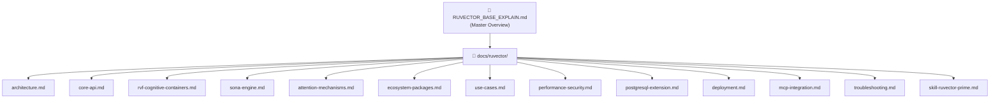

# RuVector Documentation

> **Primary reference**: [../RUVECTOR_BASE_EXPLAIN.md](../RUVECTOR_BASE_EXPLAIN.md)
> **Repository**: [ruvnet/ruvector](https://github.com/ruvnet/ruvector) — v0.88.0

This folder contains the complete technical documentation for the RuVector ecosystem,
focused on practical TypeScript/Node.js/JavaScript usage with framework-agnostic guidance
compatible with VSCode, OpenCode, and any IDE.

## Document Map



## Contents

### Foundation

| Document | Summary |
|----------|---------|
| [architecture.md](architecture.md) | System architecture, component diagrams, DDD bounded contexts, runtime layers, data flow |
| [core-api.md](core-api.md) | `@ruvector/core` — VectorDb class, all methods, TypeScript types, HNSW configuration |

### Advanced Systems

| Document | Summary |
|----------|---------|
| [rvf-cognitive-containers.md](rvf-cognitive-containers.md) | RVF binary format, COW branching, witness chains, 24 segment types, CLI reference |
| [sona-engine.md](sona-engine.md) | SONA self-learning engine, Micro-LoRA, EWC++, trajectory recording, LLM integration |
| [attention-mechanisms.md](attention-mechanisms.md) | 46 attention types, Flash/Linear/Hyperbolic/Mincut-gated attention, GNN integration |

### Reference

| Document | Summary |
|----------|---------|
| [ecosystem-packages.md](ecosystem-packages.md) | All 49+ npm packages, versions, descriptions, install commands, platform matrix |
| [use-cases.md](use-cases.md) | Practical TypeScript examples: RAG, agent memory, semantic search, swarms, MCP |
| [performance-security.md](performance-security.md) | Benchmarks, SIMD tuning, quantization, post-quantum crypto, witness chains |

### Deployment & Integration

| Document | Summary |
|----------|---------|
| [postgresql-extension.md](postgresql-extension.md) | Drop-in pgvector replacement: 290+ SQL functions, multi-tenancy, GNN in SQL |
| [deployment.md](deployment.md) | Server, Browser/WASM, Edge, Docker, self-booting `.rvf`, Cloudflare Workers, Deno |
| [mcp-integration.md](mcp-integration.md) | MCP server setup, agent tool registration, memory integration |

### Operations

| Document | Summary |
|----------|---------|
| [troubleshooting.md](troubleshooting.md) | Diagnostic matrix, HNSW tuning guide, OOM, slow search, low recall fixes |

### AI Agent SKILL

| Document | Summary |
|----------|---------|
| [skill-ruvector-prime.md](skill-ruvector-prime.md) | Canonical system prompt for "RuVector Prime" AI coding assistant |

## SKILL Integration

The canonical SKILL file is `skill-ruvector-prime.md`. Three IDE/environment-specific
stub files reference it so any change propagates automatically:

```
docs/ruvector/skill-ruvector-prime.md   ← Edit this one only
        ↑
        │ (referenced by)
        ├── .github/skills/bmad-ruvector-prime/SKILL.md
        ├── .opencode/skills/bmad-ruvector-prime/SKILL.md
        └── .agent/skills/bmad-ruvector-prime/SKILL.md
```

## Package Quick Reference

```bash
npm install @ruvector/core         # Core vector database (HNSW, k-NN search)
npm install @ruvector/rvf          # RVF cognitive containers (COW, witness chains)
npm install @ruvector/sona         # Self-learning SONA engine (Micro-LoRA, EWC++)
npm install @ruvector/attention    # 46 attention mechanisms for GNN
npm install @ruvector/ruvllm       # Local LLM runtime (GGUF, speculative decoding)
npm install rvlite                 # Lightweight standalone edge database
npm install agentdb                # AI agent long-term memory (alpha)
npx ruvector                       # Interactive installer / CLI
```

## Recommended Learning Path

1. Start with [architecture.md](architecture.md) to understand how components relate.
2. Follow [core-api.md](core-api.md) to build your first vector store.
3. Explore [use-cases.md](use-cases.md) for production-ready patterns.
4. Integrate the AI SKILL from [skill-ruvector-prime.md](skill-ruvector-prime.md) into
   your editor for context-aware RuVector assistance.
