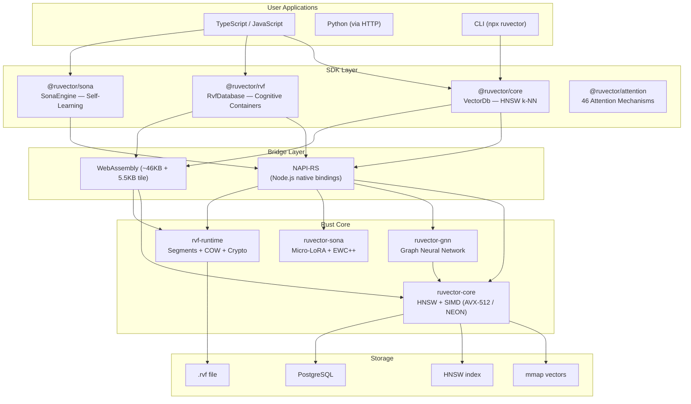
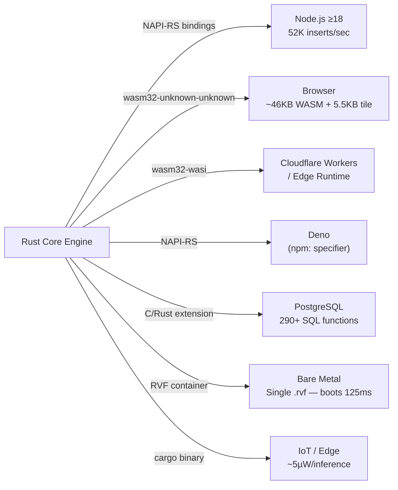
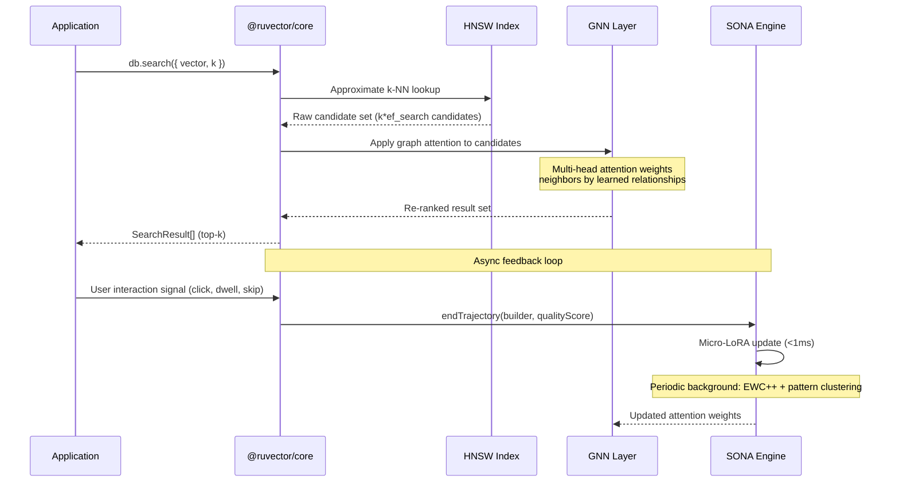
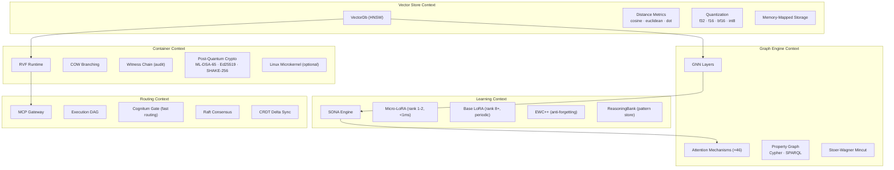
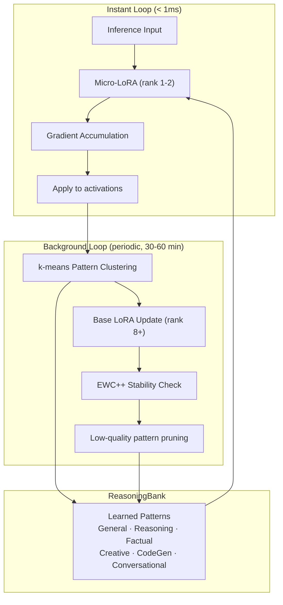

# RuVector: System Architecture

> **Back to index**: [README.md](README.md)

## Overview

RuVector is structured around Domain-Driven Design (DDD) bounded contexts, each published as
separate Rust crates and npm packages. The system composes a vector store, a graph neural network
(GNN), a self-learning engine (SONA), and a universal binary format (RVF) that can encapsulate and
deploy all components as a single file.

## High-Level Component Diagram

## Runtime Deployment Targets

## Query Processing Pipeline

## DDD Bounded Contexts

## RVF Segment Structure

The RVF format packs multiple typed segments into a single binary file. Every tool preserves
unknown segments, enabling backward compatibility.

```mermaid
graph LR
    subgraph "RVF File (example: agent_memory.rvf)"
        M["0x00 MANIFEST_SEG<br/>File UUID, dimension, metric"]
        V["0x01 VEC_SEG<br/>Raw float32/int8 vectors"]
        I["0x02 INDEX_SEG<br/>HNSW graph structure"]
        ME["0x03 META_SEG<br/>JSON / CBOR metadata"]
        Q["0x04 QUANT_SEG<br/>Quantization codebooks"]
        OV["0x05 OVERLAY_SEG<br/>LoRA adapter weights"]
        G["0x06 GRAPH_SEG<br/>Property graph adjacency"]
        W["0x0B WITNESS_SEG<br/>Append-only audit chain"]
        CR["0x0A CRYPTO_SEG<br/>Signatures + key material"]
        K["0x0E KERNEL_SEG<br/>Linux microkernel (optional)"]
        COW["0x20 COW_MAP_SEG<br/>Copy-on-write cluster map"]
    end
```

## SONA Dual-Loop Learning Architecture

## Mathematical Foundations

### HNSW (Hierarchical Navigable Small Worlds)

The index is organized as hierarchical layers. Layer 0 contains all vectors; higher layers
contain random subsets for long-range jumps. Search starts at the top layer and greedily
descends, pruning traversal with early-exit when GNN coherence confidence exceeds threshold.

- **ef_construction** — candidate pool size during index build (higher = better recall, slower build)
- **m** — number of bidirectional links per node (higher = better recall, more memory)
- **ef_search** — candidate pool at query time (tune for recall vs. latency trade-off)

### Sheaf Laplacian (Prime Radiant Coherence Engine)

RuVector extends the standard graph Laplacian to a **sheaf Laplacian** that measures the
*residual inconsistency* across the vector graph. Given a query response, it computes:

$$\delta = \| \mathcal{L}_{\mathcal{F}} \cdot x \|$$

where $\mathcal{L}_{\mathcal{F}}$ is the Coboundary map of the sheaf over the graph. When
$\delta$ exceeds a configurable threshold, the system flags the output as a potential hallucination.

### Stoer-Wagner Mincut

Applied to the attention routing graph to identify the weakest computational paths. Paths
below the mincut threshold are pruned, reducing unnecessary computation by up to **50%**
without significant recall loss.

## Key Design Principles

- **Files under 500 lines** — all source files are kept small; bounded contexts enforce separation.
- **Typed interfaces** — every public API uses strict TypeScript types (full `.d.ts` declarations).
- **Event Sourcing** — all database state changes flow through immutable events recorded in the witness chain.
- **TDD London School** — mock-first testing; integration tests verify bounded context contracts.
- **Zero secrets in code** — input validation at all system boundaries; file paths sanitized against traversal.
