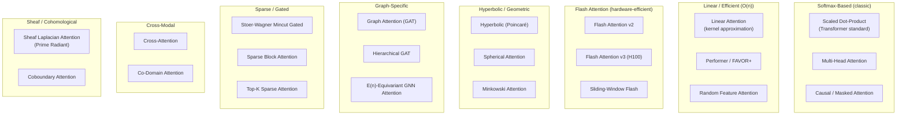

# Attention Mechanisms — `@ruvector/attention`

> **Back to index**: [README.md](README.md)
> **npm**: `npm install @ruvector/attention`
> **Peer dep**: `@ruvector/core ≥0.88.0`

`@ruvector/attention` provides 46 differentiable attention mechanisms for use in the GNN layer
and custom attention-routing pipelines. All implementations are SIMD-accelerated via the same
Rust core used by `@ruvector/core`.

## Why 46 Mechanisms?

Different workloads benefit from different inductive biases:

- **Semantic search**: Cosine-normalizing Flash attention
- **Graph reasoning**: Hyperbolic/Poincaré attention for hierarchical data
- **Long-context agents**: Linear attention (O(n) vs O(n²))  
- **Sparse, high-dimensional data**: Sparse Mincut-gated attention
- **Multi-modal**: Cross-modal attention bridges

Rather than forcing you to choose one mechanism globally, RuVector lets you compose mechanisms
per query type, per layer, or per agent role.

## Mechanism Categories



## TypeScript API

### Select and Configure an Attention Mechanism

```typescript
import {
  AttentionMechanism,
  FlashAttentionV2,
  HyperbolicAttention,
  MinCutGatedAttention,
  LinearAttention,
  MultiHeadAttention,
  GraphAttention,
  SheafLaplacianAttention,
  AttentionConfig,
  AttentionMechanismType,
} from '@ruvector/attention';
```

### `MultiHeadAttention` (default for GNN layer)

Standard scaled dot-product attention, parallelized across multiple heads. Best all-around
choice when you do not have strong domain-specific priors.

```typescript
const mha = new MultiHeadAttention({
  numHeads: 8,
  headDim: 64,         // Queries/keys projected to this size per head
  dropout: 0.1,        // Disabled at inference time automatically
  causal: false,       // Set true for autoregressive (masked) attention
});

// Apply to a batch of k-NN result embeddings
const attended = await mha.forward(queryEmbeddings, keyEmbeddings, valueEmbeddings);
```

### `FlashAttentionV2` (recommended for large candidate sets)

Memory-efficient O(n) space implementation via tiling. Up to 4× faster than naive attention
for candidate sets > 512 vectors.

```typescript
const flash = new FlashAttentionV2({
  numHeads: 8,
  headDim: 64,
  blockSize: 128,       // Tile size; tune for your GPU/CPU cache
  causal: false,
});

const reranked = await flash.forward(queries, keys, values);
```

### `LinearAttention` (O(n) time with kernel approximation)

Replaces the softmax with a kernel feature map for linear-time attention. Suitable for  
sessions with very long query histories (e.g. multi-turn agents with 10K+ context tokens).

```typescript
const linearAttn = new LinearAttention({
  numHeads: 4,
  headDim: 32,
  kernelType: 'elu',    // 'elu' | 'relu' | 'random-fourier'
  numRandomFeatures: 256, // Only used when kernelType = 'random-fourier'
});
```

### `HyperbolicAttention` (Poincaré ball)

Projects embeddings into hyperbolic space before computing attention. Captures hierarchical
structure (taxonomies, ontologies, org charts) that Euclidean attention misses.

```typescript
const hyperbolicAttn = new HyperbolicAttention({
  numHeads: 4,
  headDim: 32,
  curvature: -1.0,     // Negative curvature; larger magnitude = more hyperbolic
});
```

### `MinCutGatedAttention` (Stoer-Wagner)

Applies a Stoer-Wagner mincut to the attention graph to identify and prune weak connections.
Reduces compute by ~50% on sparse, high-dimensional data without significant recall loss.

```typescript
const mincut = new MinCutGatedAttention({
  numHeads: 8,
  headDim: 64,
  mincutThreshold: 0.2, // Edges with weight < threshold are pruned
});
```

### `GraphAttention` (GAT)

Classic Graph Attention Network layer for re-ranking within the HNSW neighbor graph.
Uses learnable attention coefficients on graph edges rather than on the full pairwise matrix.

```typescript
const gat = new GraphAttention({
  inDim: 1536,
  outDim: 256,
  numHeads: 8,
  concat: true,        // Concatenate vs average head outputs
  leakyReluSlope: 0.2,
  dropout: 0.1,
});
```

### `SheafLaplacianAttention` (Prime Radiant / Coherence Detection)

Computes the sheaf Laplacian over the result graph to detect structural inconsistency —
the theoretical basis for hallucination detection in RuVector.

$$\delta = \| \mathcal{L}_{\mathcal{F}} \cdot x \|$$

When $\delta$ exceeds the `coherenceThreshold`, the result is flagged as potentially
hallucinated.

```typescript
const sheaf = new SheafLaplacianAttention({
  numHeads: 4,
  headDim: 64,
  coherenceThreshold: 0.35, // Flag results with Laplacian norm > this value
});

const { attended, coherenceScores, flagged } = await sheaf.forwardWithCoherence(q, k, v);
console.log('Potentially hallucinated results:', flagged); // indices into result set
```

## Composing Mechanisms in a GNN Pipeline

```typescript
import { VectorDb } from '@ruvector/core';
import {
  FlashAttentionV2,
  GraphAttention,
  SheafLaplacianAttention,
} from '@ruvector/attention';

const db = new VectorDb({ dimensions: 1536 });

// Build a 3-layer GNN pipeline:
// 1. Flash attention for fast candidate filtering
// 2. GAT for graph-aware re-ranking
// 3. Sheaf attention for coherence/hallucination detection
const flash = new FlashAttentionV2({ numHeads: 8, headDim: 64, causal: false });
const gat   = new GraphAttention({ inDim: 512, outDim: 256, numHeads: 4, concat: true });
const sheaf = new SheafLaplacianAttention({ numHeads: 2, headDim: 64, coherenceThreshold: 0.3 });

async function gnnSearch(queryVector: Float32Array, k = 10) {
  // Step 1: Fetch candidate set (k * expansion factor)
  const candidates = await db.search({ vector: queryVector, k: k * 6 });

  // Step 2: Convert candidates to embedding matrix
  const embMatrix = buildEmbeddingMatrix(candidates); // Float32Array[candidates.length × 1536]

  // Step 3: Flash attention for efficient initial filtering
  const flashOut = await flash.forward(embMatrix, embMatrix, embMatrix);

  // Step 4: GAT re-ranking using graph topology
  const adjMatrix = buildAdjacencyMatrix(candidates);  // Neighbor links from HNSW
  const gatOut = await gat.forward(flashOut, adjMatrix);

  // Step 5: Coherence check
  const { attended, flagged } = await sheaf.forwardWithCoherence(gatOut, gatOut, gatOut);
  if (flagged.length > 0) {
    console.warn(`${flagged.length} potentially incoherent results detected`);
  }

  return rankAndTrim(attended, candidates, k);
}

function buildEmbeddingMatrix(_candidates: any[]): Float32Array { return new Float32Array(); }
function buildAdjacencyMatrix(_candidates: any[]): Float32Array { return new Float32Array(); }
function rankAndTrim(_attended: any, candidates: any[], k: number) { return candidates.slice(0, k); }
```

## Complete Mechanism Reference

| # | Name | Category | Time Complexity | Key Parameter |
|---|------|---------|:-:|--------------|
| 1 | `MultiHeadAttention` | Softmax | O(n²) | `numHeads` |
| 2 | `ScaledDotProductAttention` | Softmax | O(n²) | `scale` |
| 3 | `CausalAttention` | Softmax | O(n²) | `contextLen` |
| 4 | `FlashAttentionV2` | Flash | O(n) space | `blockSize` |
| 5 | `FlashAttentionV3` | Flash | O(n) space | `blockSize` |
| 6 | `SlidingWindowFlashAttention` | Flash | O(n·w) | `windowSize` |
| 7 | `LinearAttention` | Linear kernel | O(n) | `kernelType` |
| 8 | `PerformerAttention` (FAVOR+) | Linear kernel | O(n) | `numRandomFeatures` |
| 9 | `RandomFeatureAttention` | Linear kernel | O(n) | `numFeatures` |
| 10 | `HyperbolicAttention` | Geometric | O(n²) | `curvature` |
| 11 | `SphericalAttention` | Geometric | O(n²) | `radius` |
| 12 | `MinkowskiAttention` | Geometric | O(n²) | `p` (Lp norm) |
| 13 | `GraphAttention` (GAT) | Graph | O(edges) | `numHeads` |
| 14 | `HierarchicalGAT` | Graph | O(edges) | `levels` |
| 15 | `EquivariantGNNAttention` | Graph | O(edges) | `groupOrder` |
| 16 | `MinCutGatedAttention` | Sparse | O(n·m) | `mincutThreshold` |
| 17 | `SparseBlockAttention` | Sparse | O(n·b) | `blockSize` |
| 18 | `TopKSparseAttention` | Sparse | O(n·k) | `k` |
| 19 | `SheafLaplacianAttention` | Cohomological | O(n²) | `coherenceThreshold` |
| 20 | `CoboundaryAttention` | Cohomological | O(edges) | `sheafDim` |
| 21 | `CrossAttention` | Cross-modal | O(n·m) | – |
| 22 | `CoDomainAttention` | Cross-modal | O(n·m) | `domainDim` |
| 23–46 | (additional mechanisms) | Various | Varies | See package docs |

Full API documentation for all 46 mechanisms: [npmjs.com/package/@ruvector/attention](https://www.npmjs.com/package/@ruvector/attention)
