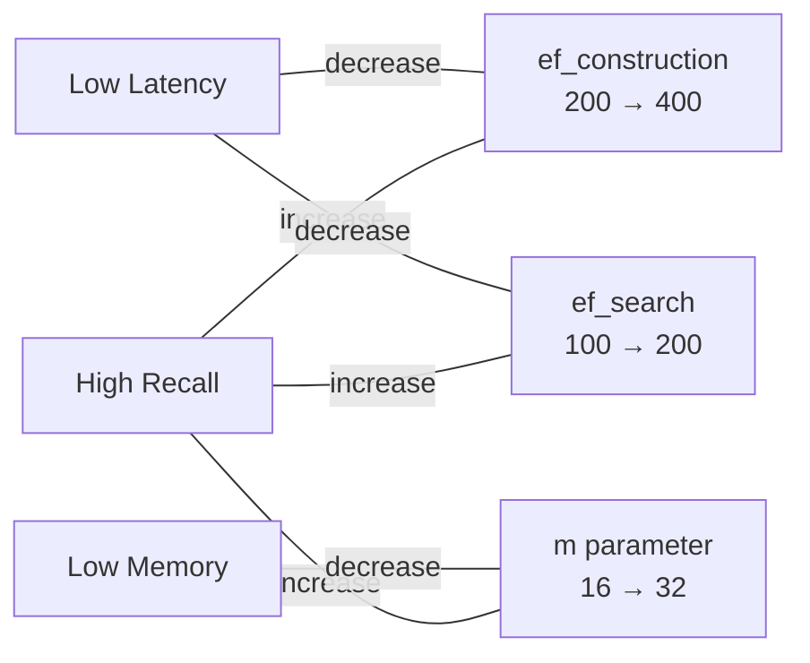

# RuVector Core API — `@ruvector/core`

> **Back to index**: [README.md](README.md)
> **npm**: `npm install @ruvector/core` (formerly `ruvector-core`, still on npm as alias)
> **Node.js**: ≥18 | **Platforms**: Linux x64/ARM64, macOS x64/ARM64, Windows x64

`@ruvector/core` is the primary Node.js package for vector storage and search. It wraps the
Rust HNSW engine via NAPI-RS, providing full TypeScript type declarations and async-first APIs.

## Installation

```bash
npm install @ruvector/core
# or
yarn add @ruvector/core
# or
pnpm add @ruvector/core
```

The correct native module for your platform is installed automatically as an optional dependency.

## TypeScript Types

```typescript
// All types are exported from the package root
import {
  VectorDb,
  VectorEntry,
  SearchQuery,
  SearchResult,
} from '@ruvector/core';

/** Constructor options for VectorDb */
interface VectorDbOptions {
  /** Vector dimensionality — must match your embedding model. Required. */
  dimensions: number;
  /** Maximum number of vectors the index will hold. Default: 10 000. */
  maxElements?: number;
  /** Path to persist the index on disk. Omit for in-memory-only mode. */
  storagePath?: string;
  /** HNSW construction candidate pool. Higher → better recall, slower build. Default: 200. */
  ef_construction?: number;
  /** HNSW bidirectional link count. Higher → better recall, more memory. Default: 16. */
  m?: number;
  /** Distance function. Default: 'cosine'. */
  distanceMetric?: 'cosine' | 'euclidean' | 'dot';
}

/** A single vector with optional ID and arbitrary metadata */
interface VectorEntry {
  /** User-defined string ID. Auto-generated UUID if omitted. */
  id?: string;
  /** The embedding vector. Must match db.dimensions. */
  vector: Float32Array | number[];
  /** Any JSON-serializable payload stored alongside the vector. */
  metadata?: Record<string, unknown>;
}

/** k-NN search parameters */
interface SearchQuery {
  /** The query vector matched against the index. */
  vector: Float32Array | number[];
  /** Number of nearest neighbors to return. */
  k: number;
  /** Optional metadata filter (exact-match on top-level keys). */
  filter?: Record<string, unknown>;
}

/** A single search result */
interface SearchResult {
  /** The vector's ID string. */
  id: string;
  /** Similarity score. For cosine: 1.0 = identical, 0.0 = orthogonal. */
  score: number;
  /** The metadata attached during insert. */
  metadata?: Record<string, unknown>;
}
```

## VectorDb Class

### Constructor

```typescript
import { VectorDb } from '@ruvector/core';

// Persistent store — index is saved/loaded from disk automatically
const db = new VectorDb({
  dimensions: 1536,          // OpenAI text-embedding-3-small / ada-002 output size
  maxElements: 1_000_000,    // Pre-allocate for 1M vectors
  storagePath: './data/vectors.db',
  distanceMetric: 'cosine',  // Always use 'cosine' for normalized LLM embeddings
  ef_construction: 200,
  m: 16,
});

// In-memory only — useful for testing and ephemeral workloads
const memDb = new VectorDb({
  dimensions: 384,  // e.g. all-MiniLM-L6-v2 output
});
```

### `insert(entry: VectorEntry): Promise<string>`

Insert a single vector. Returns the assigned ID string.

```typescript
const id = await db.insert({
  id: 'document-abc-001',  // Omit to get an auto-generated UUID
  vector: embeddingFromModel,
  metadata: {
    source: 'legal-corpus',
    page: 42,
    language: 'en',
    created: new Date().toISOString(),
  },
});
console.log('Inserted with ID:', id); // 'document-abc-001'
```

### `search(query: SearchQuery): Promise<SearchResult[]>`

Find the k nearest neighbors. Returns results sorted by descending similarity score.

```typescript
const results = await db.search({
  vector: queryEmbedding,
  k: 10,
  // Optional: filter restricts candidates before scoring
  filter: { source: 'legal-corpus', language: 'en' },
});

for (const result of results) {
  console.log(`[${result.score.toFixed(4)}] ${result.id}`, result.metadata);
}
```

### `delete(id: string): Promise<boolean>`

Remove a vector by ID. Returns `true` if found and deleted, `false` if not found.

```typescript
const removed = await db.delete('document-abc-001');
```

### `get(id: string): Promise<VectorEntry | null>`

Retrieve a vector and its metadata by ID. Returns `null` if not found.

```typescript
const entry = await db.get('document-abc-001');
if (entry) {
  console.log('Vector dims:', entry.vector.length);
  console.log('Metadata:', entry.metadata);
}
```

### `len(): Promise<number>`

Return the total number of vectors currently in the index.

```typescript
const count = await db.len();
console.log(`Index contains ${count} vectors`);
```

## HNSW Configuration Guide



| Parameter | Default | Effect of Increasing | Use When |
|-----------|---------|---------------------|----------|
| `ef_construction` | 200 | Better index quality, slower build | Building once; accuracy matters |
| `m` | 16 | Better recall, more RAM | Dataset fits in memory comfortably |
| `ef_search` | auto | Better recall, slower queries | High-accuracy production workloads |

```typescript
// High-recall configuration (e.g. legal, medical domains)
const highRecall = new VectorDb({
  dimensions: 1536,
  ef_construction: 400,
  m: 32,
  distanceMetric: 'cosine',
});

// Low-latency configuration (e.g. real-time recommendations)
const lowLatency = new VectorDb({
  dimensions: 256,
  ef_construction: 100,
  m: 8,
  distanceMetric: 'dot',
});
```

## Distance Metrics

| Metric | Identifier | Best For |
|--------|-----------|----------|
| Cosine similarity | `'cosine'` | Normalized LLM embeddings (OpenAI, Cohere, sentence-transformers) |
| Euclidean (L2) | `'euclidean'` | Raw, non-normalized feature vectors |
| Dot product | `'dot'` | When vectors are pre-normalized and speed is critical |

```typescript
// Cosine: score 1.0 = identical direction, 0.0 = orthogonal, -1.0 = opposite
const cosineDb = new VectorDb({ dimensions: 1536, distanceMetric: 'cosine' });

// Euclidean: score is L2 distance (lower = more similar); results still sorted descending by similarity
const euclideanDb = new VectorDb({ dimensions: 128, distanceMetric: 'euclidean' });
```

## Complete Working Example: Semantic Document Search

```typescript
import { VectorDb, VectorEntry, SearchResult } from '@ruvector/core';
import OpenAI from 'openai';

const openai = new OpenAI({ apiKey: process.env.OPENAI_API_KEY }); // Never hardcode keys

const db = new VectorDb({
  dimensions: 1536,       // text-embedding-3-small produces 1536-dim vectors
  maxElements: 50_000,
  storagePath: './data/docs.db',
  distanceMetric: 'cosine',
  ef_construction: 200,
  m: 16,
});

async function embedText(text: string): Promise<Float32Array> {
  const response = await openai.embeddings.create({
    model: 'text-embedding-3-small',
    input: text,
  });
  return new Float32Array(response.data[0].embedding);
}

async function indexDocuments(docs: Array<{ id: string; text: string; meta?: Record<string, unknown> }>) {
  for (const doc of docs) {
    const vector = await embedText(doc.text);
    await db.insert({ id: doc.id, vector, metadata: doc.meta });
  }
  console.log(`Indexed ${await db.len()} documents`);
}

async function semanticSearch(query: string, topK = 5): Promise<SearchResult[]> {
  const queryVector = await embedText(query);
  return db.search({ vector: queryVector, k: topK });
}

// Usage
await indexDocuments([
  { id: 'doc-1', text: 'Contract law governs agreements between parties.', meta: { domain: 'legal' } },
  { id: 'doc-2', text: 'Neural networks learn by adjusting weights.', meta: { domain: 'ml' } },
]);

const results = await semanticSearch('legal agreements and obligations');
console.log(results);
// [{ id: 'doc-1', score: 0.94, metadata: { domain: 'legal' } }, ...]
```

## Batch Insert Pattern

For large datasets, insert in batches to improve throughput:

```typescript
async function batchIndex(
  texts: string[],
  batchSize = 100,
): Promise<void> {
  for (let i = 0; i < texts.length; i += batchSize) {
    const batch = texts.slice(i, i + batchSize);

    // Parallel embedding (respect rate limits in production)
    const entries: VectorEntry[] = await Promise.all(
      batch.map(async (text, j) => ({
        id: `doc-${i + j}`,
        vector: await embedText(text),
        metadata: { index: i + j },
      })),
    );

    for (const entry of entries) {
      await db.insert(entry);
    }

    console.log(`Progress: ${Math.min(i + batchSize, texts.length)}/${texts.length}`);
  }
}
```

## CommonJS Usage

```javascript
const { VectorDb } = require('@ruvector/core');

const db = new VectorDb({ dimensions: 128 });
db.insert({ vector: new Float32Array(128), metadata: { note: 'example' } })
  .then(id => console.log('Inserted:', id));
```

## Persistence Notes

- When `storagePath` is provided, the index is persisted on every successful write and restored
  automatically on the next `new VectorDb(...)` call with the same path.
- The storage format is version-tagged; do not rename or move the file while the database is open.
- For large datasets (> available RAM), enable memory-mapped storage via the RVF layer
  (`@ruvector/rvf`), which supports `mmap` by default.

## Platform Support

| Platform | Architecture | Status |
|----------|-------------|--------|
| Linux | x64 (GNU) | Stable |
| Linux | ARM64 (GNU) | Stable |
| macOS | x64 Intel | Stable |
| macOS | ARM64 Apple Silicon | Stable |
| Windows | x64 MSVC | Stable |

**Node.js 18+ required.** The native module is automatically selected via optional dependencies.
