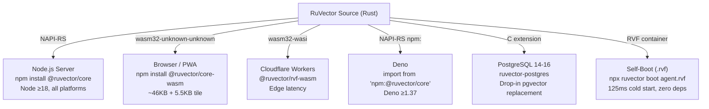
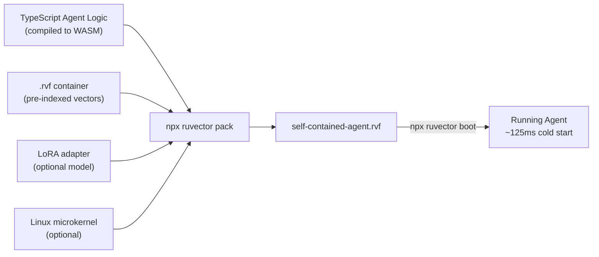

# Deployment Guide

> **Back to index**: [README.md](README.md)

RuVector supports six deployment targets from the same codebase: Node.js servers, browsers,
Cloudflare Workers, Deno, PostgreSQL, and self-booting `.rvf` containers.

## Deployment Options Overview



---

## 1. Node.js Server

### Installation

```bash
npm install @ruvector/core
# Optional: add SONA and RVF
npm install @ruvector/rvf @ruvector/sona
```

### Express.js REST API Example

```typescript
import express from 'express';
import { VectorDb } from '@ruvector/core';

const app = express();
app.use(express.json());

const db = new VectorDb({
  dimensions: 1536,
  storagePath: './data/vectors.db',
  distanceMetric: 'cosine',
});

app.post('/vectors', async (req, res) => {
  // Validate input at system boundary
  const { id, vector, metadata } = req.body as { id?: string; vector: number[]; metadata?: Record<string, unknown> };
  if (!Array.isArray(vector) || vector.length !== 1536) {
    return res.status(400).json({ error: 'vector must be a number[1536]' });
  }
  const insertedId = await db.insert({ id, vector: new Float32Array(vector), metadata });
  res.status(201).json({ id: insertedId });
});

app.post('/search', async (req, res) => {
  const { vector, k = 10, filter } = req.body as { vector: number[]; k?: number; filter?: Record<string, unknown> };
  if (!Array.isArray(vector) || vector.length !== 1536) {
    return res.status(400).json({ error: 'vector must be a number[1536]' });
  }
  const results = await db.search({ vector: new Float32Array(vector), k: Math.min(k, 100), filter });
  res.json({ results });
});

app.listen(3000, () => console.log('Vector API running on :3000'));
```

### Docker

```dockerfile
FROM node:20-alpine
WORKDIR /app
COPY package*.json ./
RUN npm ci --omit=dev
COPY . .
EXPOSE 3000
CMD ["node", "dist/server.js"]
```

```yaml
# docker-compose.yml
services:
  vector-api:
    build: .
    ports: ['3000:3000']
    volumes:
      - vector-data:/app/data
    environment:
      - NODE_ENV=production
volumes:
  vector-data:
```

---

## 2. Browser / PWA

### Installation

```bash
npm install @ruvector/core-wasm
```

### Vite / Webpack Setup

```typescript
// vite.config.ts — enable WASM support
import { defineConfig } from 'vite';

export default defineConfig({
  optimizeDeps: { exclude: ['@ruvector/core-wasm'] },
  assetsInclude: ['**/*.wasm'],
});
```

```typescript
// src/vectorSearch.ts
import init, { VectorDbWasm } from '@ruvector/core-wasm';

let db: VectorDbWasm;

export async function initSearch(dimensions: number) {
  await init();  // Load the .wasm binary (one-time)
  db = new VectorDbWasm({ dimensions, distanceMetric: 'cosine' });
}

export async function addDocument(id: string, vector: Float32Array, metadata: unknown) {
  db.insert({ id, vector, metadata });
}

export async function search(queryVector: Float32Array, k = 5) {
  return db.search({ vector: queryVector, k });
}
```

### CDN / No-Bundler

```html
<script type="module">
  import init, { VectorDbWasm } from 'https://cdn.jsdelivr.net/npm/@ruvector/core-wasm/+esm';
  await init();
  const db = new VectorDbWasm({ dimensions: 384 });
  // use db normally
</script>
```

---

## 3. Cloudflare Workers

```bash
npm install @ruvector/rvf-wasm wrangler
```

```typescript
// worker.ts
import { rvf_open_memory, rvf_insert, rvf_search } from '@ruvector/rvf-wasm';
import wasmModule from '@ruvector/rvf-wasm/rvf_bg.wasm';

interface Env { VECTOR_KV: KVNamespace }

export default {
  async fetch(request: Request, env: Env): Promise<Response> {
    // Initialize WASM on first request (cached in isolate lifecycle)
    const { default: init } = await import('@ruvector/rvf-wasm');
    await init(wasmModule);

    const url = new URL(request.url);

    if (request.method === 'POST' && url.pathname === '/search') {
      const { vector, k } = await request.json() as { vector: number[]; k: number };
      const db = rvf_open_memory({ dimensions: vector.length, distanceMetric: 'cosine' });
      const results = rvf_search(db, { vector: new Float32Array(vector), k });
      return Response.json({ results });
    }

    return new Response('Not Found', { status: 404 });
  },
};
```

```toml
# wrangler.toml
name = "vector-edge"
main = "worker.ts"

[build]
command = "npm run build"

[[rules]]
type = "CompiledWasm"
globs = ["**/*.wasm"]
```

---

## 4. Deno

```typescript
// server.ts (Deno)
import { VectorDb } from 'npm:@ruvector/core';
import { serve } from 'https://deno.land/std@0.208.0/http/server.ts';

const db = new VectorDb({ dimensions: 1536, distanceMetric: 'cosine' });

serve(async (req: Request) => {
  if (req.method === 'POST') {
    const body = await req.json();
    const results = await db.search({
      vector: new Float32Array(body.vector),
      k: body.k ?? 5,
    });
    return Response.json({ results });
  }
  return new Response('OK');
}, { port: 8000 });
```

```bash
deno run --allow-net --allow-read --allow-write --unstable-ffi server.ts
```

---

## 5. Self-Booting `.rvf` Agent

Pack an entire AI agent — vectors, weights, tools, and Linux kernel — into a single portable file.



```bash
# 1. Build agent to WASM
npm run build:wasm  # produces dist/agent.wasm

# 2. Pre-index your vectors into a base container
npx ruvector init --dimensions 1536 --output base.rvf
npx ruvector insert base.rvf --vectors data/embeddings.jsonl

# 3. Pack into a self-contained container
npx ruvector pack base.rvf \
  --wasm dist/agent.wasm \
  --config agent.json \
  --output production-agent.rvf

# Optional: include a Linux microkernel for full isolation
npx ruvector pack base.rvf \
  --kernel ./kernels/microlinux-6.6.bin \
  --wasm dist/agent.wasm \
  --output isolated-agent.rvf

# 4. Boot anywhere — no Node.js, no dependencies
npx ruvector boot production-agent.rvf
# Or with the static binary:
./ruvector boot production-agent.rvf
```

### Self-Boot Cold Start Breakdown

| Phase | Time |
|-------|------|
| `.rvf` file open + manifest parse | ~5ms |
| HNSW index load (1M vectors, mmap) | ~90ms |
| LoRA adapter load | ~15ms |
| WASM JIT compilation | ~12ms |
| Agent initialization | ~3ms |
| **Total** | **~125ms** |

---

## 6. IoT / Edge (Bare Metal)

RuVector compiles to a static binary with no runtime dependencies, enabling deployment on
resource-constrained devices:

```bash
# Cross-compile for ARM64
cargo build --release --target aarch64-unknown-linux-gnu

# On device
./ruvector serve --rvf agent.rvf --port 8080 --dimensions 128
```

| Device Class | Recommended Config | Notes |
|--|--|--|
| Raspberry Pi 4 | dim=128, int8, m=8 | ~45MB RAM for 100K vectors |
| Industrial PLC | dim=64, int8, m=4 | Headless; use static binary |
| Microcontroller | Not recommended | Minimum 4MB RAM; use HTTP proxy |

---

## Environment Configuration

```dotenv
# .env (never commit this file)
RUVECTOR_STORAGE_PATH=./data/vectors.db
RUVECTOR_DIMENSIONS=1536
RUVECTOR_METRIC=cosine
RUVECTOR_EF_CONSTRUCTION=200
RUVECTOR_M=16

# Signing key — 32 hex bytes for ML-DSA-65 seed
RUVECTOR_SIGNING_KEY=<your-64-char-hex-key>
```

```typescript
import { VectorDb } from '@ruvector/core';

const db = new VectorDb({
  dimensions: parseInt(process.env.RUVECTOR_DIMENSIONS ?? '1536', 10),
  storagePath: process.env.RUVECTOR_STORAGE_PATH,
  distanceMetric: (process.env.RUVECTOR_METRIC ?? 'cosine') as 'cosine' | 'euclidean' | 'dot',
  ef_construction: parseInt(process.env.RUVECTOR_EF_CONSTRUCTION ?? '200', 10),
  m: parseInt(process.env.RUVECTOR_M ?? '16', 10),
});
```
