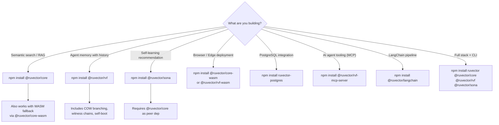

# Ecosystem Packages — All npm Distributions

> **Back to index**: [README.md](README.md)
> **Registry**: [npmjs.com/~ruvnet](https://www.npmjs.com/~ruvnet)

RuVector is published as modular npm packages. Install only what you need.

## Core Packages

| Package | Version | Description | Size |
|---------|---------|-------------|------|
| `ruvector` | 0.88.0 | CLI + interactive installer | – |
| `@ruvector/core` | 0.88.0 | Vector DB with HNSW k-NN (main API) | ~52KB NAPI |
| `@ruvector/rvf` | 0.88.0 | RVF cognitive containers (COW, witness chain) | ~180KB NAPI |
| `@ruvector/sona` | 0.88.0 | Self-learning engine (Micro-LoRA, EWC++) | ~95KB NAPI |
| `@ruvector/attention` | 0.88.0 | 46 attention mechanism types | ~40KB NAPI |
| `@ruvector/gnn` | 0.88.0 | Graph neural network layer | ~60KB NAPI |

## Platform-Specific Native Binaries

These optional dependencies are auto-resolved; you rarely need to install them directly.

| Package | Platform |
|---------|---------|
| `@ruvector/core-linux-x64-gnu` | Linux x64 |
| `@ruvector/core-linux-arm64-gnu` | Linux ARM64 |
| `@ruvector/core-darwin-x64` | macOS Intel |
| `@ruvector/core-darwin-arm64` | macOS Apple Silicon |
| `@ruvector/core-win32-x64-msvc` | Windows x64 |

Each SDK package (`@ruvector/core`, `@ruvector/rvf`, etc.) follows the same naming convention
for its own platform-specific binaries.

## WASM Distributions

| Package | Target | Description |
|---------|--------|-------------|
| `@ruvector/core-wasm` | Browser + Node.js | Core k-NN via WebAssembly |
| `@ruvector/rvf-wasm` | Browser + Workers | RVF operations in-browser |
| `ruvector-wasm` | Generic | All-in-one WASM bundle |

## PostgreSQL Extension

| Package | Description |
|---------|-------------|
| `@ruvector/pg-extension` | PostgreSQL loadable extension |
| `ruvector-postgres` | Drop-in pgvector replacement (290+ functions) |

## Integration Packages

| Package | Description |
|---------|-------------|
| `@ruvector/rvf-mcp-server` | Model Context Protocol (MCP) server |
| `@ruvector/langchain` | LangChain vectorstore adapter |
| `@ruvector/llamaindex` | LlamaIndex vector store adapter |
| `@ruvector/huggingface` | HuggingFace transformers embedding bridge |

## Installation Matrix



## Platform Support Matrix

| Platform | `@ruvector/core` | `@ruvector/rvf` | `@ruvector/sona` | WASM | PostgreSQL |
|----------|:---:|:---:|:---:|:---:|:---:|
| Node.js 18+ Linux x64 | ✅ | ✅ | ✅ | ✅ | ✅ |
| Node.js 18+ Linux ARM64 | ✅ | ✅ | ✅ | ✅ | ✅ |
| Node.js 18+ macOS x64 | ✅ | ✅ | ✅ | ✅ | ✅ |
| Node.js 18+ macOS ARM64 | ✅ | ✅ | ✅ | ✅ | ✅ |
| Node.js 18+ Windows x64 | ✅ | ✅ | ✅ | ✅ | – |
| Deno (npm: specifier) | ✅ | ✅ | ✅ | ✅ | – |
| Browser (Chrome/Firefox) | via WASM | via WASM | – | ✅ | – |
| Cloudflare Workers | – | via WASM | – | ✅ | – |
| PostgreSQL 14–16 | – | – | – | – | ✅ |

## Semantic Version Policy

RuVector follows **semver** within each major version cycle:

- All `@ruvector/*` packages are released together with matching minor versions.
- `.rvf` file format is **backward-compatible**: a v0.88 runtime reads v0.80 files transparently.
- N-API binding versions are pinned; no `node-gyp` rebuilds required after npm install.
- WASM bundles are cached via `node_modules/.cache`; CDN builds include content-hash in filename.

## Minimal Install Examples

```bash
# RAG application (OpenAI embeddings + semantic search)
npm install @ruvector/core openai

# Agent memory system with audit log
npm install @ruvector/rvf

# Self-improving recommendation engine
npm install @ruvector/core @ruvector/sona

# Browser vector search (no server required)
npm install @ruvector/core-wasm

# Complete AI agent platform
npm install ruvector @ruvector/core @ruvector/rvf @ruvector/sona @ruvector/attention
```

## Verifying Integrity

All packages are published with provenance via GitHub Actions. Verify with:

```bash
npm audit
npm install --prefer-offline  # Uses cached verified binaries

# Verify a published package signature (npmjs.com audit)
npm view @ruvector/core dist.integrity
```
