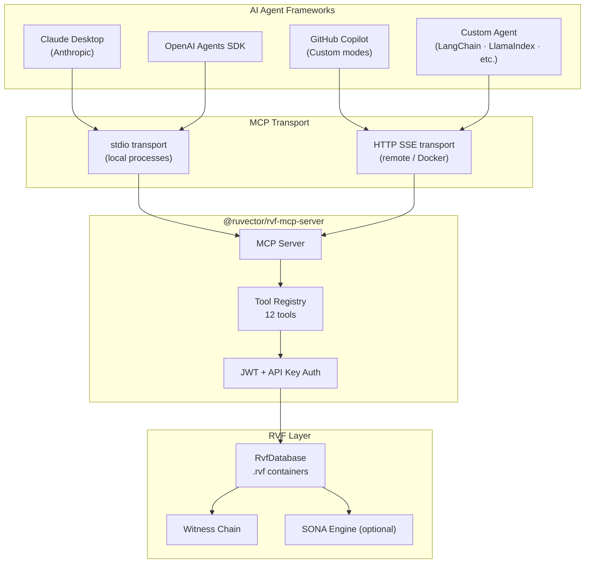
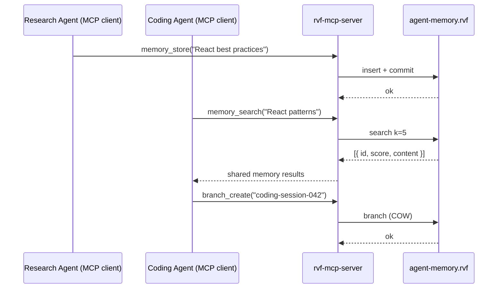

# MCP Integration — `@ruvector/rvf-mcp-server`

> **Back to index**: [README.md](README.md)
> **npm**: `npm install @ruvector/rvf-mcp-server`
> **Protocol**: [Model Context Protocol](https://modelcontextprotocol.io) v1.x

The `@ruvector/rvf-mcp-server` package exposes RuVector's full API as an MCP server,
allowing any MCP-compatible AI agent framework to use persistent, versioned vector memory
with a witness-chain audit trail — without writing any integration code.

## Architecture



## Quick Start

```bash
# Install globally for CLI use
npm install -g @ruvector/rvf-mcp-server

# Start with default in-memory store (testing)
npx rvf-mcp-server

# Start with persistent .rvf file
npx rvf-mcp-server --rvf ./agent-memory.rvf --dimensions 1536

# With authentication
npx rvf-mcp-server --rvf ./agent-memory.rvf --api-key $(openssl rand -hex 32)
```

## Claude Desktop Integration (`claude_desktop_config.json`)

```json
{
  "mcpServers": {
    "ruvector-memory": {
      "command": "npx",
      "args": [
        "rvf-mcp-server",
        "--rvf", "/absolute/path/to/agent-memory.rvf",
        "--dimensions", "1536",
        "--metric", "cosine"
      ],
      "env": {
        "RUVECTOR_API_KEY": "your-secret-api-key"
      }
    }
  }
}
```

## VS Code / GitHub Copilot Integration

```json
// .vscode/mcp.json
{
  "servers": {
    "ruvector-memory": {
      "type": "stdio",
      "command": "npx",
      "args": ["rvf-mcp-server", "--rvf", "./agent-memory.rvf", "--dimensions", "1536"],
      "env": {
        "RUVECTOR_API_KEY": "${env:RUVECTOR_API_KEY}"
      }
    }
  }
}
```

## OpenCode Integration

```yaml
# .opencode/config.yaml
mcp:
  servers:
    ruvector:
      command: npx
      args:
        - rvf-mcp-server
        - --rvf
        - ./agent-memory.rvf
        - --dimensions
        - "1536"
      env:
        RUVECTOR_API_KEY: "${RUVECTOR_API_KEY}"
```

## Available MCP Tools (12)

All tools are exposed as MCP tool calls with JSON Schema input/output.

### `memory_store`

Store a text memory with auto-embedding.

```json
{
  "tool": "memory_store",
  "arguments": {
    "id": "pref-001",
    "content": "User prefers TypeScript over JavaScript",
    "metadata": { "category": "preference", "author": "system" },
    "tags": ["preference", "language"]
  }
}
```

### `memory_search`

Semantic search over stored memories.

```json
{
  "tool": "memory_search",
  "arguments": {
    "query": "coding language preferences",
    "k": 5,
    "filter": { "category": "preference" }
  }
}
```

**Response:**
```json
{
  "results": [
    { "id": "pref-001", "score": 0.94, "content": "User prefers TypeScript over JavaScript", "metadata": {...} }
  ]
}
```

### `memory_delete`

Remove a stored memory by ID.

```json
{ "tool": "memory_delete", "arguments": { "id": "pref-001" } }
```

### `memory_get`

Retrieve a specific memory by ID.

```json
{ "tool": "memory_get", "arguments": { "id": "pref-001" } }
```

### `memory_stats`

Return usage statistics.

```json
{ "tool": "memory_stats", "arguments": {} }
```

**Response:**
```json
{
  "vectorCount": 1842,
  "branches": ["main", "experiment-v2"],
  "fileSizeBytes": 14680064,
  "witnessEntries": 1842
}
```

### `branch_create`

Create a COW branch of the current memory state.

```json
{ "tool": "branch_create", "arguments": { "name": "session-20240115" } }
```

### `branch_list`

List all existing branches.

```json
{ "tool": "branch_list", "arguments": {} }
```

### `branch_switch`

Switch the active working branch.

```json
{ "tool": "branch_switch", "arguments": { "name": "session-20240115" } }
```

### `branch_merge`

Merge a branch into main.

```json
{
  "tool": "branch_merge",
  "arguments": {
    "source": "session-20240115",
    "mode": "squash"
  }
}
```

### `commit`

Commit pending changes with a descriptive message.

```json
{ "tool": "commit", "arguments": { "message": "Store user session preferences" } }
```

### `witness_verify`

Verify the integrity of the entire witness chain audit log.

```json
{ "tool": "witness_verify", "arguments": {} }
```

**Response:**
```json
{
  "valid": true,
  "entryCount": 1842,
  "latestHash": "sha256:a1b2c3...",
  "tampered": false
}
```

### `export_context`

Export all memories matching a filter as a compact context string (for LLM prompts).

```json
{
  "tool": "export_context",
  "arguments": {
    "filter": { "category": "preference" },
    "maxTokens": 2000,
    "format": "markdown"
  }
}
```

## Programmatic Usage (TypeScript)

```typescript
import { RvfMcpServer } from '@ruvector/rvf-mcp-server';

const server = new RvfMcpServer({
  rvfPath: './agent-memory.rvf',
  dimensions: 1536,
  distanceMetric: 'cosine',
  transport: 'stdio',       // 'stdio' | 'http-sse'
  port: 3001,               // Only used when transport = 'http-sse'
  apiKey: process.env.RUVECTOR_API_KEY,
  enableSona: true,         // Enable self-learning
  sonaConfig: {
    microLoraRank: 2,
    minQualityScore: 0.6,
  },
});

await server.start();
console.log('RuVector MCP server running');
```

## Multi-Agent Shared Memory Example



## Docker Deployment

```yaml
# docker-compose.yml
services:
  mcp-server:
    image: ruvnet/rvf-mcp-server:0.88.0
    ports:
      - "3001:3001"
    volumes:
      - ./memory:/data
    environment:
      - RUVECTOR_API_KEY=${RUVECTOR_API_KEY}
      - RVF_PATH=/data/agent-memory.rvf
      - RVF_DIMENSIONS=1536
      - TRANSPORT=http-sse
      - PORT=3001
```

## Security

- All HTTP endpoints require `Authorization: Bearer <api-key>` header.
- stdio transport is process-local; no network exposure.
- Witness chain provides tamper-evident logging of all tool calls.
- API keys must be passed via environment variables — never hardcoded.
