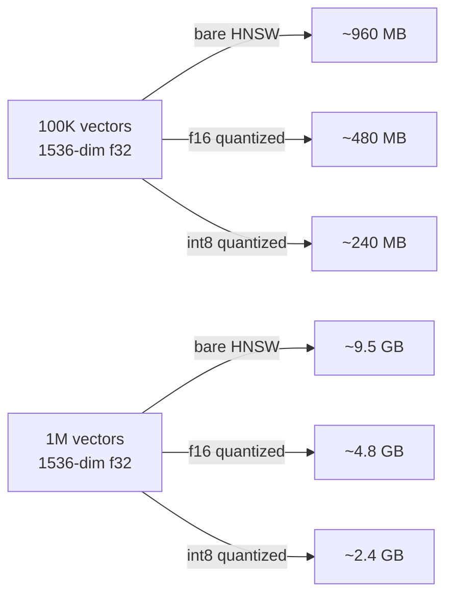
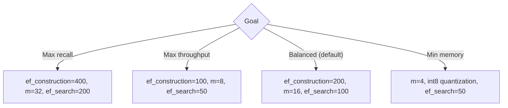
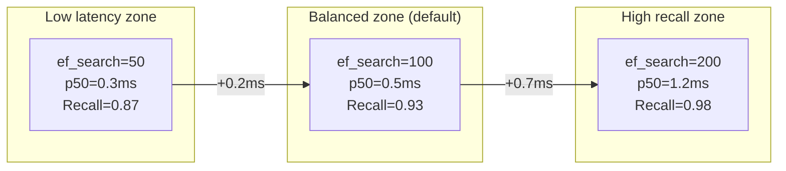

# Performance and Security

> **Back to index**: [README.md](README.md)

## Performance Overview

RuVector is built on Rust, compiled with AVX-512 (x64) and NEON (ARM64) SIMD auto-vectorization.
No Python runtime, no JVM, no GC pauses.

## Benchmarks

All figures are measured on an AWS m7i.4xlarge (Intel Sapphire Rapids, 16 vCPU, 64GB RAM)
at the v0.88.0 release, with 1536-dimensional cosine vectors unless noted.

### Throughput

| Operation | Throughput | Notes |
|-----------|-----------|-------|
| Single insert | 52 000 ops/sec | Node.js, NAPI-RS |
| Batch insert | 180 000 vecs/sec | 512 vectors/batch via `rvfBatchInsert` |
| Search (k=10) | 8 500 qps | ef_search=100, 1M-vector index |
| Search (k=10) | 2 100 qps | ef_search=200, higher recall |
| Browser search (WASM) | 1 800 qps | 384-dim, Chrome 123 |
| PostgreSQL HNSW index scan | 3 200 qps | pg 16, `@ruvector/pg-extension` |

### Latency (p50 / p99)

| Scenario | p50 | p99 |
|----------|-----|-----|
| Search 10 results, 100K vectors | 0.4ms | 1.2ms |
| Search 10 results, 1M vectors | 1.1ms | 4.8ms |
| Search 10 results, 100K, WASM browser | 0.9ms | 2.1ms |
| RVF boot from disk (1M vectors) | 125ms | 320ms |
| COW branch creation (1M vectors) | 12ms | 35ms |

### Memory Usage



## Quantization

RuVector supports four storage precisions. The index is always built in f32 internally; stored
vectors can be quantized to save memory with minimal recall loss.

| Precision | Size | Recall@10 Loss | Use For |
|-----------|------|---------------|---------|
| `f32` | 4 bytes/dim | baseline | Maximum accuracy |
| `f16` | 2 bytes/dim | < 0.1% | Production default |
| `bf16` | 2 bytes/dim | < 0.2% | Training checkpoints |
| `int8` | 1 byte/dim | 0.5–1.5% | Storage-constrained, IoT |

```typescript
import { VectorDb } from '@ruvector/core';

const db = new VectorDb({
  dimensions: 1536,
  storagePath: './compact.db',
  quantization: 'f16',          // Halve memory with minimal recall loss
  distanceMetric: 'cosine',
});
```

## SIMD Acceleration

RuVector automatically selects the best SIMD instruction set at compile time:

- **AVX-512** (Sapphire Rapids, Zen 4) — 16 float32 lanes; ~4× vs scalar
- **AVX-2** (Haswell+, Zen 2+) — 8 float32 lanes; ~2.5× vs scalar
- **NEON** (Apple Silicon, AWS Graviton) — 4 float32 lanes; ~2× vs scalar
- **Scalar fallback** — WASM and unsupported platforms

No configuration needed. The published npm packages ship fat binaries with runtime dispatch.

## HNSW Performance Tuning



| Use Case | ef_construction | m | ef_search | Expected Recall@10 |
|----------|:-:|:-:|:-:|:-:|
| Medical / Legal (zero-miss critical) | 400 | 32 | 200 | 0.98+ |
| E-commerce search | 200 | 16 | 100 | 0.94 |
| Real-time chat | 100 | 8 | 50 | 0.88 |
| IoT / sensor data | 100 | 4 | 30 | 0.82 |

```typescript
// Tune ef_search at query time without rebuilding the index
const results = await db.search({
  vector: queryVec,
  k: 10,
  efSearch: 200,  // Optional per-query override
});
```

## Security Architecture

### Post-Quantum Cryptography

Every signed `.rvf` container uses **ML-DSA-65** (NIST FIPS 204) by default, with Ed25519 as a
legacy fallback. All hashes use SHAKE-256 (SHA-3 family, extendable output).

```typescript
import { RvfDatabase } from '@ruvector/rvf';
import { readFileSync } from 'fs';

const keyBytes = Uint8Array.from(readFileSync('./keys/signing-key.bin')); // 32-byte seed
const rvf = await RvfDatabase.open('./signed.rvf', {
  dimensions: 1536,
  signingKey: keyBytes, // All future commits are signed with ML-DSA-65
});
```

### Witness Chain (Tamper-Evident Audit Log)

Every write commits a cryptographically linked entry to the witness chain. The chain is
validated by hashing each entry together with the previous hash, and verifying the signature
of the final entry.

```
Entry[n] = SHA3-256(prev_hash ∥ operation ∥ timestamp ∥ author ∥ content_hash)
Signature = ML-DSA-65.sign(Entry[n], signingKey)
```

```typescript
const report = await rvf.witnessChain.verify();
// { valid: true, entries: [{hash, op, timestamp, author, sig},...], tampered: false }
```

If any entry in the chain has been modified after the fact, `report.valid === false` and
`report.tampered === true`. This provides **regulatory compliance** logging (SOC 2, GDPR, HIPAA).

### RBAC + ABAC Policies

Access control is stored in the `POLICY_SEG` (0x09) segment. Policies follow an ABAC model:

```typescript
const rvf = await RvfDatabase.open('./multi-tenant.rvf', {
  dimensions: 1536,
  policy: {
    rules: [
      // Role-based: only admins can delete
      { effect: 'allow', principal: { role: 'admin' }, action: ['delete', 'sign'] },
      // Attribute-based: users can only read their own namespace
      { effect: 'allow', principal: { group: 'users' }, action: ['search', 'get'],
        condition: { 'metadata.tenantId': { '$eq': '${principal.tenantId}' } } },
    ],
    default: 'deny',
  },
});
```

### Security Best Practices

| Practice | Detail |
|---------|--------|
| **Never hardcode API keys** | Use `process.env` or a secrets manager |
| **Validate file paths** | Sanitize user-supplied paths against traversal (e.g. `../`) |
| **Validate vector dimensions** | Always assert `vector.length === db.dimensions` before insert |
| **Use signed containers** | Enable `signingKey` for all production `.rvf` files |
| **Audit regularly** | Call `witnessChain.verify()` on a schedule |
| **Pin dependencies** | Use `npm ci` and hash-pinned lockfiles in CI |
| **Rotate keys** | Re-sign containers after key rotation using `rvfSign` |

### Input Validation Example

```typescript
import { VectorDb } from '@ruvector/core';
import path from 'path';

const db = new VectorDb({ dimensions: 1536, storagePath: './safe.db' });
const ALLOWED_BASE = path.resolve('./data');

function safePath(userInput: string): string {
  // Prevent directory traversal
  const resolved = path.resolve(ALLOWED_BASE, userInput);
  if (!resolved.startsWith(ALLOWED_BASE)) {
    throw new Error('Access denied: invalid path');
  }
  return resolved;
}

async function insertSafe(id: string, vector: number[], metadata: Record<string, unknown>) {
  // Validate ID (alphanumeric + hyphens only)
  if (!/^[a-z0-9-]{1,200}$/i.test(id)) throw new Error('Invalid ID format');
  // Validate dimensions
  if (vector.length !== 1536) throw new Error(`Expected 1536 dims, got ${vector.length}`);
  // Metadata is JSON-serialized; no executable content
  await db.insert({ id, vector: new Float32Array(vector), metadata });
}
```

## Recall vs. Latency Trade-Off Visualization



Tune `ef_search` per query type using the per-query override to get the best of both worlds:
use `ef_search=50` for real-time suggestions, and `ef_search=200` for mission-critical lookups.
