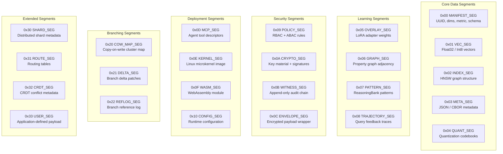

# RVF Cognitive Containers — `@ruvector/rvf`

> **Back to index**: [README.md](README.md)
> **npm**: `npm install @ruvector/rvf`
> **Peer dep**: `@ruvector/core ≥0.88.0`

An `.rvf` file is a **Cognitive Container**: a single binary that packs vectors, graph indices,
learned model weights, metadata, secret keys, and optionally a full Linux microkernel. RVF files
are self-sufficient enough to boot into an AI agent.

## Quick Start

```bash
# CLI tools (no install required)
npx ruvector init --dimensions 1536 --output agent.rvf
npx ruvector insert agent.rvf --vectors embeddings.jsonl
npx ruvector search agent.rvf --query "find similar items to..." --k 10
npx ruvector status agent.rvf
```

```typescript
import { RvfDatabase } from '@ruvector/rvf';

// Open (or create) an RVF container
const rvf = await RvfDatabase.open('./agent.rvf', {
  dimensions: 1536,
  distanceMetric: 'cosine',
  efConstruction: 200,
  m: 16,
});

// All VectorDb operations are available
const id = await rvf.insert({ vector: embedding, metadata: { doc: 'intro' } });
const results = await rvf.search({ vector: queryVector, k: 5 });
```

## RvfDatabase API

### `RvfDatabase.open(path, options)`

```typescript
interface RvfOpenOptions {
  dimensions: number;
  distanceMetric?: 'cosine' | 'euclidean' | 'dot';
  efConstruction?: number;
  m?: number;
  /** Open read-only; writes throw */
  readOnly?: boolean;
  /** Signing key (Ed25519 seed 32 bytes) for witness chain entries */
  signingKey?: Uint8Array;
}

const rvf = await RvfDatabase.open('./memory.rvf', {
  dimensions: 1536,
  distanceMetric: 'cosine',
});
```

### `branch(name: string): Promise<RvfDatabase>`

Create a copy-on-write branch. The branch shares all unchanged data with the parent; only
pages modified after branching are duplicated. Branching a 1M-vector container creates a
~2.5MB delta file — not a full copy.

```typescript
// Create a named branch for an A/B test
const experiment = await rvf.branch('experiment-2024-q1');

// Modify the branch without affecting the main container
await experiment.insert({ vector: newEmbedding, metadata: { version: 'exp' } });

// Later merge back to main (cherry-pick mode)
await rvf.merge(experiment, { mode: 'cherry-pick' });

await experiment.close();
```

### `commit(message: string): Promise<string>`

Commit all pending writes. Returns the commit hash. Each commit is recorded as a
tamper-evident entry in the witness chain.

```typescript
await rvf.insert({ vector: embedding, metadata: { source: 'batch-42' } });
const commitHash = await rvf.commit('Add batch-42 embeddings');
console.log('Committed:', commitHash);
// 'sha256:a1b2c3d4...'
```

### `listBranches(): Promise<string[]>`

```typescript
const branches = await rvf.listBranches();
// ['main', 'experiment-2024-q1', 'staging']
```

### `merge(source: RvfDatabase, options?): Promise<void>`

```typescript
// Merge all changes from source into this container
await main.merge(experiment, {
  mode: 'cherry-pick',   // 'fast-forward' | 'squash' | 'cherry-pick'
  conflictStrategy: 'ours', // 'ours' | 'theirs' | 'union'
});
```

### `witnessChain.verify(): Promise<VerificationReport>`

```typescript
const report = await rvf.witnessChain.verify();
console.log(report.valid);          // true / false
console.log(report.entries);        // Audit trail entries
console.log(report.signature);      // ML-DSA-65 or Ed25519 signature
```

### `getStats(): Promise<RvfStats>`

```typescript
const stats = await rvf.getStats();
console.log(stats.vectorCount);     // Total vectors
console.log(stats.segmentCount);    // Number of segments on disk
console.log(stats.fileSizeBytes);   // Physical file size
console.log(stats.branches);        // Active branch names
```

### `close(): Promise<void>`

Always close the database when done to flush pending writes and release file handles.

```typescript
try {
  // ... your operations
} finally {
  await rvf.close();
}
```

## The 24 Segment Types

Each segment is identified by a one-byte type code. The runtime ignores unknown segments,
enabling forward compatibility.



## 19 N-API (Node.js Native) Methods

These are the raw native bindings exposed by `@ruvector/rvf`'s NAPI-RS layer. You normally
access them through the `RvfDatabase` class, but they are also callable directly:

| # | Method | Description |
|---|--------|-------------|
| 1 | `rvfOpen(path, opts)` | Open or create an RVF file |
| 2 | `rvfClose(handle)` | Flush and close a file handle |
| 3 | `rvfInsert(handle, entry)` | Insert a single vector |
| 4 | `rvfBatchInsert(handle, entries)` | Insert many vectors (SIMD-optimized) |
| 5 | `rvfSearch(handle, query)` | k-NN search |
| 6 | `rvfDelete(handle, id)` | Remove a vector |
| 7 | `rvfGet(handle, id)` | Retrieve vector + metadata by ID |
| 8 | `rvfLen(handle)` | Count vectors |
| 9 | `rvfBranch(handle, name)` | Create a COW branch |
| 10 | `rvfMerge(dest, src, opts)` | Merge branches |
| 11 | `rvfCommit(handle, msg)` | Commit pending writes |
| 12 | `rvfLog(handle)` | Return commit history |
| 13 | `rvfVerifyWitness(handle)` | Verify witness chain integrity |
| 14 | `rvfSign(handle, key)` | Sign the container with Ed25519 / ML-DSA-65 |
| 15 | `rvfExportSegment(handle, type)` | Export a raw segment as Uint8Array |
| 16 | `rvfImportSegment(handle, type, data)` | Import a raw segment |
| 17 | `rvfGetStats(handle)` | File statistics and segment map |
| 18 | `rvfRepack(path)` | Defragment and compact the file |
| 19 | `rvfListBranches(handle)` | List all branch names |

## 29 WASM Exports

When loaded in a browser or Cloudflare Workers via `@ruvector/rvf/wasm`:

```typescript
import init, {
  RvfWasm,
  rvf_open_memory,
  rvf_insert,
  rvf_search,
  rvf_delete,
  rvf_len,
  rvf_branch,
  rvf_merge,
  rvf_commit,
  rvf_verify_witness,
  rvf_export_segment,
  rvf_import_segment,
  rvf_get_stats,
  rvf_repack,
  rvf_list_branches,
  // ... 14 more
} from '@ruvector/rvf/wasm';

await init(); // One-time async initialization

const db = rvf_open_memory({ dimensions: 1536, distanceMetric: 'cosine' });
rvf_insert(db, { vector: Float32Array.from(embedding), metadata: {} });
const results = rvf_search(db, { vector: Float32Array.from(queryVec), k: 5 });
```

## CLI Commands Reference

All 18 CLI commands are available via `npx ruvector`:

```bash
# File management
npx ruvector init --dimensions 1536 --output db.rvf
npx ruvector status db.rvf                           # Segment map, vector count, file size
npx ruvector repack db.rvf                           # Defragment and compact

# Vector operations
npx ruvector insert db.rvf --vectors embeddings.jsonl
npx ruvector search  db.rvf --query "semantic query" --k 10
npx ruvector delete  db.rvf --id doc-001

# Branching (git-like)
npx ruvector branch  db.rvf experiment-v2
npx ruvector merge   db.rvf --source experiment-v2 --mode cherry-pick
npx ruvector log     db.rvf
npx ruvector diff    db.rvf --from main --to experiment-v2

# Security and audit
npx ruvector sign    db.rvf --key ./keys/ed25519.pem
npx ruvector verify  db.rvf                          # Verify witness chain
npx ruvector audit   db.rvf --since 2024-01-01

# Segment inspection
npx ruvector segments db.rvf                         # List all segments
npx ruvector export   db.rvf --segment 0x05 --output overlay.bin
npx ruvector import   db.rvf --segment 0x05 --input overlay.bin

# Deployment
npx ruvector pack     db.rvf --kernel linux.bin --wasm agent.wasm --output agent.rvf
npx ruvector boot     agent.rvf                      # Boot self-contained agent
```

## COW Branching Example: A/B Testing Embeddings

```typescript
import { RvfDatabase } from '@ruvector/rvf';

// Production container with 500K vectors
const prod = await RvfDatabase.open('./production.rvf', { dimensions: 1536 });

// Branch costs ~2.5MB delta write — not a 2GB copy
const staging = await prod.branch('new-embedding-model');

// Rebuild index in staging with new text-embedding-3-large embeddings
await rebuildWithNewModel(staging);
await staging.commit('Rebuild with text-embedding-3-large');

// Evaluate recall vs. baseline
const recallScore = await evaluateRecall(staging, testset);
console.log('Staging recall:', recallScore); // 0.94 vs. 0.88 in main

// Only merge if staging wins
if (recallScore > 0.90) {
  await prod.merge(staging, { mode: 'fast-forward' });
  await prod.commit('Promote text-embedding-3-large index');
}

await staging.close();
await prod.close();
```

## Witness Chain Example

Every write to an RVF container is recorded in the witness chain — an append-only cryptographic
audit log. Entries are linked by hash, making tampering detectable.

```typescript
const rvf = await RvfDatabase.open('./audit.rvf', {
  dimensions: 768,
  signingKey: Uint8Array.from(Buffer.from(process.env.SIGNING_KEY_HEX!, 'hex')), // 32 bytes
});

await rvf.insert({ id: 'record-1', vector: embedding, metadata: { user: 'alice' } });
await rvf.commit('Insert: audit record-1');

const report = await rvf.witnessChain.verify();
console.log(report.valid);    // true
console.log(report.entries);  // [{hash, timestamp, operation, author, signature}, ...]
```

## Self-Booting Agent Example

Pack a fully independent AI agent into a single file:

```bash
# Prerequisites: agent.wasm built from your TypeScript agent, optional linux.bin for full isolation
npx ruvector pack \
  agent.rvf \
  --kernel linux.bin \
  --wasm agent.wasm \
  --config agent-config.json \
  --output self-contained-agent.rvf

# Boot anywhere — no dependencies, boots in 125ms
npx ruvector boot self-contained-agent.rvf
# Or: ./ruvector boot self-contained-agent.rvf (static binary)
```

The agent boots with all vectors, weights, and tools pre-loaded. Starting a 1M-vector agent
from an `.rvf` file takes approximately **125ms** on x64 Linux.
