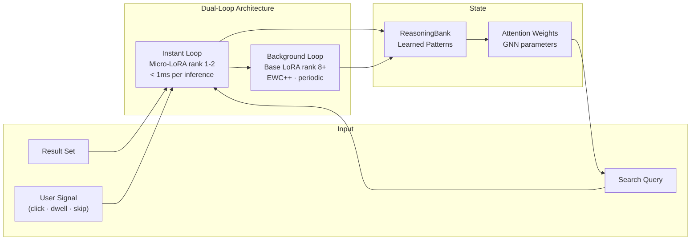
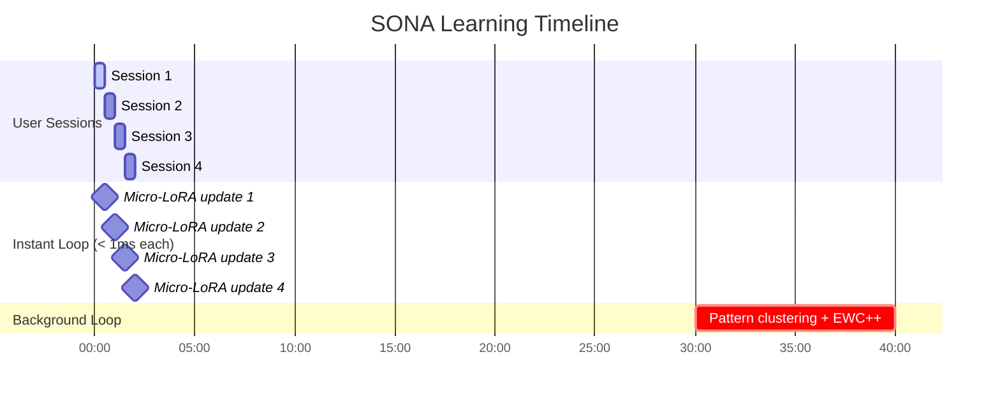

# SONA Self-Learning Engine — `@ruvector/sona`

> **Back to index**: [README.md](README.md)
> **npm**: `npm install @ruvector/sona`
> **Peer dep**: `@ruvector/core ≥0.88.0`

SONA (Self-Optimizing Neural Architecture) gives a RuVector database the ability to **learn
from usage patterns in real time** — improving relevance without manual retraining, without
sending data to external APIs, and without requiring a GPU.

## How SONA Works



The design separates adaptation speed from stability:

- **Instant loop** — A tiny LoRA adapter (rank 1-2) fires synchronously on every inference. It
  updates in under 1ms, making results feel better immediately without blocking the search path.
- **Background loop** — Every 30–60 minutes (configurable), a background thread runs EWC++
  (Elastic Weight Consolidation ++), clusters patterns, prunes outdated knowledge, and trains a
  larger base LoRA adapter (rank 8+). This prevents catastrophic forgetting.

## Installation and Setup

```typescript
import { SonaEngine } from '@ruvector/sona';
import { VectorDb } from '@ruvector/core';

const db = new VectorDb({ dimensions: 1536, storagePath: './vectors.db' });

const sona = new SonaEngine(db, {
  /** Pattern types to enable. Default: all. */
  patternTypes: ['Reasoning', 'Factual', 'CodeGen'],
  /** Micro-LoRA rank. Lower = faster update; higher = more capacity. Default: 2. */
  microLoraRank: 2,
  /** Base LoRA rank for background updates. Default: 8. */
  baseLoraRank: 8,
  /** Background update interval in milliseconds. Default: 1 800 000 (30 min). */
  backgroundIntervalMs: 1_800_000,
  /** Minimum quality score [0,1] for a trajectory to contribute to learning. Default: 0.5. */
  minQualityScore: 0.5,
});
```

## TrajectoryBuilder — Recording Feedback

A trajectory is a sequence of (query, result, feedback) triples linked together. Feeding
trajectories to SONA is how the system learns which results were useful.

```typescript
import { SonaEngine, TrajectoryBuilder, PatternType } from '@ruvector/sona';

// Start a new trajectory when a search session begins
const builder: TrajectoryBuilder = sona.startTrajectory({
  sessionId: 'user-session-xyz',           // For multi-turn linking
  patternType: PatternType.Reasoning,      // Hint for clustering
  contextVector: optionalContextEmbedding, // Optional: topic anchor
});

// Add each query-result pair
builder.addStep({
  queryVector: queryEmbedding,
  results: searchResults,        // SearchResult[] from db.search()
  userAction: 'clicked',         // 'clicked' | 'dwelt' | 'skipped' | 'expanded'
  actionTargetId: 'doc-42',      // The result the user interacted with
});

builder.addStep({
  queryVector: refinedQueryEmbedding,
  results: refinedResults,
  userAction: 'dwelt',
  actionTargetId: 'doc-87',
});

// End the trajectory with an overall quality score [0,1]
// 1.0 = user found exactly what they wanted; 0.0 = full failure
await sona.endTrajectory(builder, 0.92);
```

## SonaEngine API

### `startTrajectory(options): TrajectoryBuilder`

```typescript
interface TrajectoryOptions {
  sessionId?: string;        // Links multi-turn trajectories
  patternType?: PatternType; // See PatternType enum below
  contextVector?: Float32Array; // Topic anchor for the session
}
```

### `endTrajectory(builder, qualityScore): Promise<void>`

Submit a completed trajectory. If `qualityScore ≥ minQualityScore`, the trajectory is used
to update the Micro-LoRA adapter immediately (< 1ms) and queued for the next background cycle.

### `getLearnedPatterns(): Promise<LearnedPattern[]>`

Retrieve all patterns currently stored in the ReasoningBank.

```typescript
const patterns = await sona.getLearnedPatterns();
for (const p of patterns) {
  console.log(p.type, p.frequency, p.qualityScore, p.lastUsed);
}
```

### `triggerBackgroundUpdate(): Promise<void>`

Force the background learning cycle immediately, rather than waiting for the scheduled
interval. Useful after a large batch of trajectories.

```typescript
await sona.triggerBackgroundUpdate();
```

### `exportAdapters(): Promise<Uint8Array>`

Export the current LoRA adapters as a binary blob for external storage or transfer.

```typescript
const adapterBytes = await sona.exportAdapters();
// Save to an RVF container, S3, etc.
```

### `importAdapters(data: Uint8Array): Promise<void>`

Load previously exported adapters. Useful for deploying a pre-trained model to a fresh instance.

```typescript
await sona.importAdapters(savedAdapterBytes);
```

### `reset(): Promise<void>`

Clear all learned patterns and reset LoRA adapters to initialization state. Use for fresh starts
or when data distribution shifts significantly.

### `getStats(): Promise<SonaStats>`

```typescript
const stats = await sona.getStats();
console.log(stats.totalTrajectories);   // Trajectories processed
console.log(stats.patternCount);        // Patterns in ReasoningBank
console.log(stats.adaptationCycles);    // Background cycles completed
console.log(stats.avgQualityScore);     // Rolling average trajectory quality
```

## Pattern Types

```typescript
enum PatternType {
  /** Multi-step reasoning chains */
  Reasoning    = 'Reasoning',
  /** Factual lookup patterns */
  Factual      = 'Factual',
  /** Code generation and technical queries */
  CodeGen      = 'CodeGen',
  /** Creative and generative content */
  Creative     = 'Creative',
  /** Multi-turn dialogue */
  Conversational = 'Conversational',
  /** Allow SONA to classify the pattern automatically */
  General      = 'General',
}
```

## LearnedPattern Interface

```typescript
interface LearnedPattern {
  id: string;
  type: PatternType;
  /** Cosine centroid of all contributing query vectors */
  centroidVector: Float32Array;
  /** Number of trajectories that shaped this pattern */
  frequency: number;
  /** Average quality score of contributing trajectories */
  qualityScore: number;
  lastUsed: Date;
  created: Date;
}
```

## End-to-End Example: Improving a Search Assistant

```typescript
import { VectorDb } from '@ruvector/core';
import { SonaEngine, PatternType } from '@ruvector/sona';

const db = new VectorDb({ dimensions: 1536, storagePath: './kb.db' });
const sona = new SonaEngine(db, { microLoraRank: 2, minQualityScore: 0.6 });

async function handleSearchSession(
  userId: string,
  initialQuery: string,
  getEmbedding: (text: string) => Promise<Float32Array>,
  getUserFeedback: (results: any[]) => Promise<{ clickedId: string; rating: number }>,
): Promise<void> {
  const builder = sona.startTrajectory({
    sessionId: `session-${userId}-${Date.now()}`,
    patternType: PatternType.General,
  });

  // First search
  const queryVec = await getEmbedding(initialQuery);
  const results = await db.search({ vector: queryVec, k: 10 });

  // Collect user feedback (click + satisfaction rating [0,1])
  const { clickedId, rating } = await getUserFeedback(results);

  builder.addStep({
    queryVector: queryVec,
    results,
    userAction: rating > 0.7 ? 'dwelt' : 'skipped',
    actionTargetId: clickedId,
  });

  // Submit trajectory — SONA updates in < 1ms
  await sona.endTrajectory(builder, rating);
}
```

## Dual-Loop Learning Timeline



## LLM Integration (ruvllm)

RuVector's ecosystem includes `ruvllm`, a local inference engine for GGUF / HuggingFace models
that runs entirely on-device. While `ruvllm` is a **separate package** from `@ruvector/sona`,
they compose well: use `ruvllm` to generate embeddings and `@ruvector/sona` to learn from the
resulting query patterns, without any data ever leaving your infrastructure.

```typescript
// Hypothetical integration pattern (ruvllm is a separate install)
// import { RuvLLM } from 'ruvllm';
// const llm = new RuvLLM({ model: './models/mistral-7b-instruct.Q4_K_M.gguf' });
// const embedding = await llm.embed("my query");  // local inference → Float32Array
// await db.search({ vector: embedding, k: 5 });   // then pass to SONA
```

## EWC++ Anti-Forgetting

When SONA learns new patterns, it must not overwrite knowledge that was hard-earned from older
sessions. EWC++ (Elastic Weight Consolidation ++) implements a **soft constraint**: each weight
update is penalized proportional to how important that weight was for previously learned patterns.

$$\mathcal{L}(\theta) = \mathcal{L}_{\text{new}}(\theta) + \frac{\lambda}{2} \sum_i F_i (\theta_i - \theta_i^*)^2$$

Where $F_i$ is the Fisher information for weight $i$ (estimated importance), $\theta_i^*$ is the
previous optimal weight, and $\lambda$ controls the stability-plasticity trade-off (configurable
via `ewcLambda` in `SonaEngine` constructor options, default: `400`).
