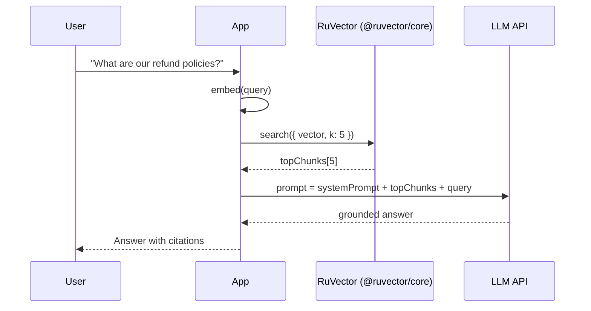
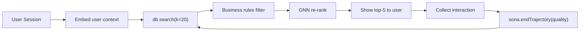
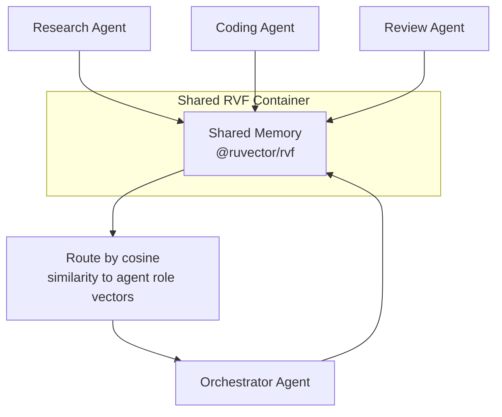

# Use Cases and Practical Guides

> **Back to index**: [README.md](README.md)

This document covers common real-world patterns with complete, runnable TypeScript examples.

## Table of Contents

1. [RAG (Retrieval-Augmented Generation)](#1-rag-retrieval-augmented-generation)
2. [Persistent Agent Memory](#2-persistent-agent-memory)
3. [Semantic Document Search](#3-semantic-document-search)
4. [Real-Time Recommendation Engine](#4-real-time-recommendation-engine)
5. [Multi-Agent Swarm Coordination](#5-multi-agent-swarm-coordination)
6. [Browser-Side Vector Search](#6-browser-side-vector-search)
7. [Duplicate Detection at Scale](#7-duplicate-detection-at-scale)

---

## 1. RAG (Retrieval-Augmented Generation)

Augment LLM responses with relevant documents retrieved from a vector database.



```typescript
import { VectorDb } from '@ruvector/core';
import OpenAI from 'openai';
import { readFileSync } from 'fs';

const openai = new OpenAI({ apiKey: process.env.OPENAI_API_KEY });
const db = new VectorDb({
  dimensions: 1536,
  storagePath: './rag-docs.db',
  distanceMetric: 'cosine',
});

// --- Indexing phase ---
async function indexMarkdownFile(filePath: string) {
  const content = readFileSync(filePath, 'utf8');
  // Split into ~512-token chunks with ~50-token overlap
  const chunks = splitIntoChunks(content, 512, 50);

  for (let i = 0; i < chunks.length; i++) {
    const { data } = await openai.embeddings.create({
      model: 'text-embedding-3-small',
      input: chunks[i],
    });

    await db.insert({
      id: `${filePath}::chunk-${i}`,
      vector: new Float32Array(data[0].embedding),
      metadata: { filePath, chunkIndex: i, text: chunks[i] },
    });
  }
}

// --- Query phase ---
async function ragQuery(userQuestion: string): Promise<string> {
  const { data } = await openai.embeddings.create({
    model: 'text-embedding-3-small',
    input: userQuestion,
  });

  const results = await db.search({
    vector: new Float32Array(data[0].embedding),
    k: 5,
  });

  const context = results
    .map(r => `[${r.metadata?.filePath}] ${r.metadata?.text}`)
    .join('\n\n---\n\n');

  const completion = await openai.chat.completions.create({
    model: 'gpt-4o-mini',
    messages: [
      {
        role: 'system',
        content: 'Answer the user question using ONLY the provided context. If the answer is not in the context, say so.',
      },
      { role: 'user', content: `Context:\n${context}\n\nQuestion: ${userQuestion}` },
    ],
  });

  return completion.choices[0].message.content ?? '';
}

function splitIntoChunks(text: string, tokensPerChunk: number, overlap: number): string[] {
  const words = text.split(/\s+/);
  const chunks: string[] = [];
  const step = tokensPerChunk - overlap;
  for (let i = 0; i < words.length; i += step) {
    chunks.push(words.slice(i, i + tokensPerChunk).join(' '));
  }
  return chunks;
}
```

---

## 2. Persistent Agent Memory

AI agents retain memory across sessions using an `.rvf` container with COW branching and an
audit trail.

```typescript
import { RvfDatabase } from '@ruvector/rvf';
import { SonaEngine } from '@ruvector/sona';

class AgentMemory {
  private db!: RvfDatabase;
  private sona!: SonaEngine;

  async init(agentId: string) {
    this.db = await RvfDatabase.open(`./memory/${agentId}.rvf`, {
      dimensions: 1536,
      distanceMetric: 'cosine',
    });
    this.sona = new SonaEngine(this.db as any, { microLoraRank: 2 });
  }

  /** Store a new memory */
  async remember(content: string, embedding: Float32Array, tags: string[]) {
    await this.db.insert({
      id: `mem-${Date.now()}`,
      vector: embedding,
      metadata: {
        content,
        tags,
        timestamp: new Date().toISOString(),
      },
    });
    await this.db.commit(`Stored memory: ${content.slice(0, 40)}...`);
  }

  /** Recall the k most relevant memories to a query */
  async recall(queryEmbedding: Float32Array, k = 5) {
    return this.db.search({ vector: queryEmbedding, k });
  }

  /** Snapshot current memory state for experimentation or backup */
  async snapshot(name: string) {
    return this.db.branch(name);
  }

  /** Verify memory integrity (tamper detection) */
  async audit() {
    return this.db.witnessChain.verify();
  }

  async close() {
    await this.db.close();
  }
}

// Usage
const memory = new AgentMemory();
await memory.init('assistant-prod');

await memory.remember(
  'User prefers concise technical explanations',
  await embed('concise technical explanation preference'),
  ['preference', 'communication-style'],
);

const relevant = await memory.recall(await embed('how to explain code'), 3);
console.log(relevant.map(r => r.metadata?.content));
```

---

## 3. Semantic Document Search

Fast, filtered document search with type-safe metadata.

```typescript
import { VectorDb, SearchResult } from '@ruvector/core';

interface DocMetadata {
  title: string;
  author: string;
  category: 'technical' | 'legal' | 'marketing';
  publishedAt: string;
  wordCount: number;
}

const db = new VectorDb({ dimensions: 1536, storagePath: './docs.db' });

async function indexDocument(doc: {
  id: string;
  title: string;
  body: string;
  meta: DocMetadata;
}, embed: (text: string) => Promise<Float32Array>) {
  const vector = await embed(`${doc.title}\n\n${doc.body}`);
  await db.insert({
    id: doc.id,
    vector,
    metadata: doc.meta,
  });
}

async function semanticSearch(
  query: string,
  category: DocMetadata['category'] | undefined,
  embed: (text: string) => Promise<Float32Array>,
  k = 10,
): Promise<Array<SearchResult & { metadata: DocMetadata }>> {
  const queryVec = await embed(query);
  const results = await db.search({
    vector: queryVec,
    k,
    // Filter applied before scoring for maximum performance
    filter: category ? { category } : undefined,
  });
  return results as Array<SearchResult & { metadata: DocMetadata }>;
}
```

---

## 4. Real-Time Recommendation Engine

Combine vector similarity with SONA adaptive learning.



```typescript
import { VectorDb } from '@ruvector/core';
import { SonaEngine, PatternType } from '@ruvector/sona';

const db = new VectorDb({ dimensions: 768, storagePath: './products.db' });
const sona = new SonaEngine(db as any, {
  patternTypes: ['General'],
  microLoraRank: 2,
  minQualityScore: 0.4,
});

interface Product {
  id: string;
  name: string;
  category: string;
  price: number;
}

async function recommend(
  userId: string,
  userHistoryEmbedding: Float32Array,
  embed: (text: string) => Promise<Float32Array>,
  maxPrice: number,
): Promise<Product[]> {
  const trajectory = sona.startTrajectory({
    sessionId: userId,
    patternType: PatternType.General,
  });

  const candidates = await db.search({
    vector: userHistoryEmbedding,
    k: 20,
    filter: undefined, // Fetch broadly; filter locally below
  });

  // Apply business rule: price filter
  const affordable = candidates.filter(r => (r.metadata as Product).price <= maxPrice);
  const top5 = affordable.slice(0, 5);

  trajectory.addStep({
    queryVector: userHistoryEmbedding,
    results: candidates,
    userAction: 'clicked',
    actionTargetId: top5[0]?.id ?? '',
  });

  return top5.map(r => r.metadata as Product);
}

async function recordPurchase(userId: string, productId: string, satisfaction: number) {
  // satisfaction: 0 (returned) to 1 (repeat customer)
  const builder = sona.startTrajectory({ sessionId: userId });
  // In a real system you'd replay the session trajectory here
  await sona.endTrajectory(builder, satisfaction);
}
```

---

## 5. Multi-Agent Swarm Coordination

Multiple agents share a vector store for collective memory and task routing.



```typescript
import { RvfDatabase } from '@ruvector/rvf';

const sharedMemory = await RvfDatabase.open('./swarm.rvf', { dimensions: 1536 });

const agentRoles = {
  research: await embed('research information gathering knowledge retrieval'),
  coding: await embed('write code implement features debug software'),
  review: await embed('review critique improve quality correctness'),
};

async function routeTask(taskDescription: string): Promise<keyof typeof agentRoles> {
  const taskVec = await embed(taskDescription);
  const results = await sharedMemory.search({ vector: taskVec, k: 1 });
  return (results[0]?.metadata?.agentRole as keyof typeof agentRoles) ?? 'coding';
}

async function storeTaskResult(
  taskId: string,
  agentRole: keyof typeof agentRoles,
  result: string,
) {
  await sharedMemory.insert({
    id: taskId,
    vector: agentRoles[agentRole],
    metadata: { agentRole, result, timestamp: new Date().toISOString() },
  });
  await sharedMemory.commit(`${agentRole} completed task ${taskId}`);
}

async function embed(_text: string): Promise<Float32Array> {
  // Replace with your embedding provider
  return new Float32Array(1536);
}
```

---

## 6. Browser-Side Vector Search

Client-only semantic search with zero server dependency using the WASM build.

```typescript
// Install: npm install @ruvector/core-wasm
import init, { VectorDbWasm } from '@ruvector/core-wasm';

// Module initialization (run once before any other calls)
await init();

const db = new VectorDbWasm({ dimensions: 384 });

// Embed in-browser with transformers.js (local model, no API calls)
import { pipeline } from '@xenova/transformers';
const extractor = await pipeline('feature-extraction', 'Xenova/all-MiniLM-L6-v2');

async function embedLocal(text: string): Promise<Float32Array> {
  const result = await extractor(text, { pooling: 'mean', normalize: true });
  return result.data as Float32Array;
}

// Index documents client-side
const docs = ['Paris is the capital of France', 'The Eiffel Tower is in Paris'];
for (let i = 0; i < docs.length; i++) {
  const vec = await embedLocal(docs[i]);
  db.insert({ id: `doc-${i}`, vector: vec, metadata: { text: docs[i] } });
}

// Search — fully local, privacy-preserving
const Q = await embedLocal('Where is the Eiffel Tower?');
const hits = db.search({ vector: Q, k: 1 });
console.log(hits[0].metadata?.text); // "The Eiffel Tower is in Paris"
```

---

## 7. Duplicate Detection at Scale

Find near-duplicate documents before indexing, preventing redundant embeddings.

```typescript
import { VectorDb } from '@ruvector/core';

const db = new VectorDb({
  dimensions: 1536,
  storagePath: './dedup.db',
  distanceMetric: 'cosine',
});

const DUPLICATE_THRESHOLD = 0.97; // Cosine similarity ≥ 0.97 → treat as duplicate

async function indexIfUnique(
  docId: string,
  text: string,
  embed: (t: string) => Promise<Float32Array>,
): Promise<{ indexed: boolean; duplicateOf?: string }> {
  const vector = await embed(text);

  // Check for near-duplicates before inserting
  const total = await db.len();
  if (total > 0) {
    const nearest = await db.search({ vector, k: 1 });
    if (nearest.length > 0 && nearest[0].score >= DUPLICATE_THRESHOLD) {
      return { indexed: false, duplicateOf: nearest[0].id };
    }
  }

  await db.insert({ id: docId, vector, metadata: { text: text.slice(0, 200) } });
  return { indexed: true };
}

// Usage
const result = await indexIfUnique('article-002', 'Machine learning improves search', embed);
if (!result.indexed) {
  console.log(`Skipped — duplicate of: ${result.duplicateOf}`);
}

async function embed(_text: string): Promise<Float32Array> {
  return new Float32Array(1536); // Replace with real embedding call
}
```
